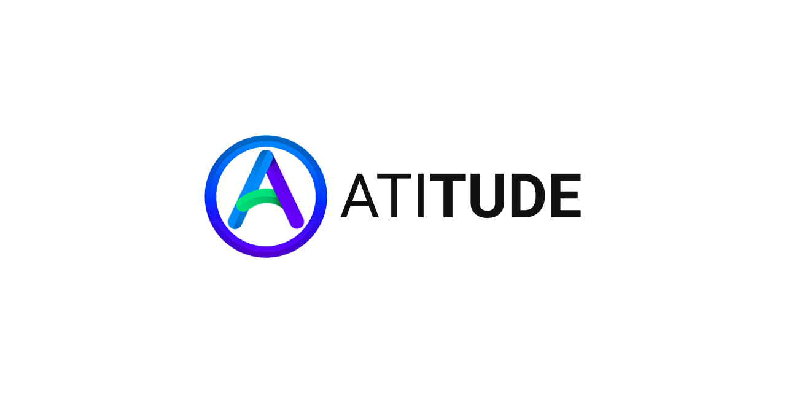

#### 🏆 _First place in the Hackatrouble_

# Project: Atitude
> The Atitude program was created to bridge the gap between doctors and patients, and helps them to have quality medical care and remotely during quarantine, avoiding physical contact and the spread of COVID-19.

## What is?

The Atitude program was created to bridge the gap between doctors and patients, and helps them to have quality medical care and remotely during quarantine, avoiding physical contact and the spread of COVID-19. The website is simple, dynamic and effective, with a language accessible to all audiences, and aims to bring access to everyone who needs to use the program's services without leaving home! The patient will undergo a screening informing his data and his symptoms, mainly to identify the presence of the Coronavirus. This information will be passed on to doctors who will be ready to assist you, directly from home. All information from doctors such as graduation, specialization and CRM will be available so that the patient feels even more secure when using the platform!

## Contact me

Gabriel de Jesus – (https://www.linkedin.com/in/gabrieldejesuss) – contato@gabrieldesenvolvedor.com